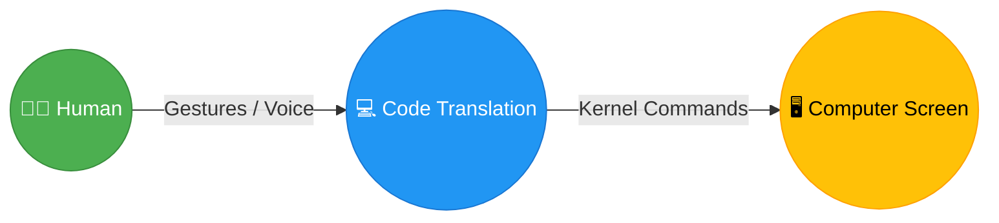
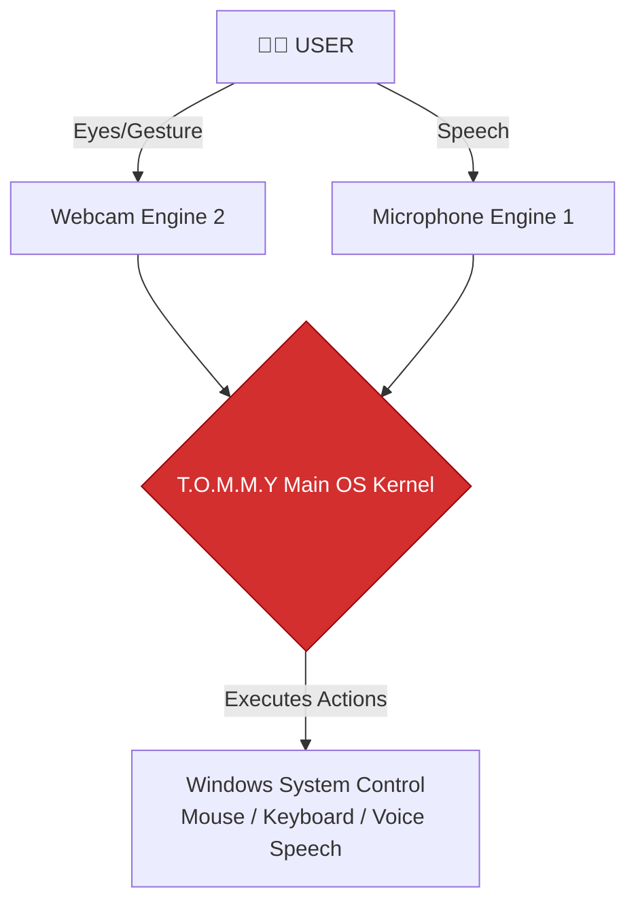
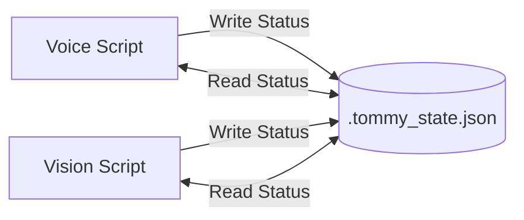
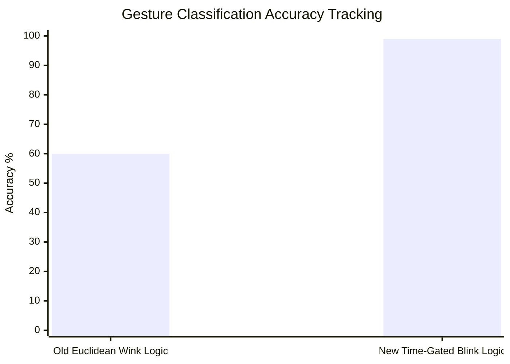
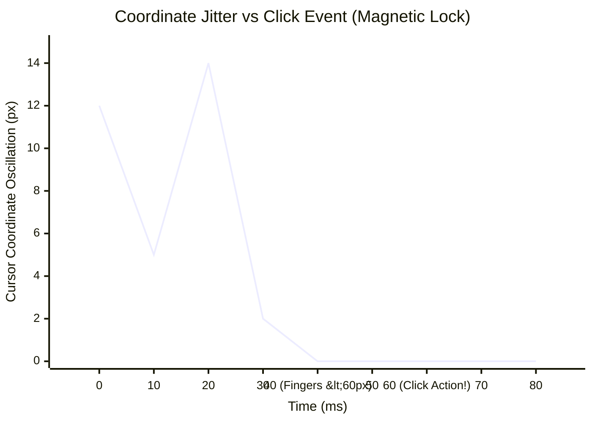

# T.O.M.M.Y. OS 👁️🧠
## A Monolithic Architecture for Zero-Touch HCI
**Revolutionizing Desktop Interaction without Cloud Dependencies**

---

# Slide 2: Project Synthesis & Objectives
* **Goal**: To engineer an advanced, multimodal Artificial Operating System (T.O.M.M.Y.).
* **The Problem**: Traditional operating systems tether humans to physical hardware (mice/keyboards) or rigid syntax-locked voice assistants.
* **The Solution**: A hands-free Human-Computer Interaction (HCI) environment that dynamically translates physical hand gestures, eye tracking, and natural voice commands into native OS controls.



---

# Slide 3: Literature Synthesis
* **Foundational Technologies Analyzed**:
  1. **Google MediaPipe**: Geometric neural mapping research for spatial Hands and FaceMesh matrices.
  2. **Wake-Word Engines**: Analysis of PyPorcupine offline NLP Speech-to-Text pipelines.
  3. **Generative AI Methods**: Local Large Language Models (LLMs) used for semantic command parsing natively.

> *(Placeholder for Logos)*
>  &nbsp;&nbsp;&nbsp;  &nbsp;&nbsp;&nbsp; 

---

# Slide 4: Research Gap Addressed
* **Current Limitations**: Existing solutions force users into isolated modes—you either use a voice assistant *or* you use a mouse. They do not blend together seamlessly.
* **The Breakthrough**: This project pioneers **Seamless Multimodal Switching**. The system uses biological cues (like intentionally closing eyes for 2.0 seconds) to mathematically route compute power back and forth between Vision and Voice interfaces instantly.

---

# Slide 5: Proposed Research Framework (Architecture)
* **Architecture Type**: The system is built as a "Dual-Core Monolithic Runtime".
* **Engine 1**: Auditory Intelligence (Ambient voice array monitoring and HUD UI).
* **Engine 2**: Spatial Mathematics (Webcam matrix processing for hands/faces).



---

# Slide 6: Inter-Process Communication (IPC)
* **The Persistence Layer**: How do two separate AI engines talk to each other without crashing?
* **Subprocess Bridge**: The system uses a localized encrypted `JSON` state-flag system (`.tommy_state.json`) to act as a synchronization bridge.
* Allows one engine to gracefully yield OS locks (like Microphone arrays or PyAutoGui threads) mathematically so they don't fight for resources. 



---

# Slide 7: Final Algorithm & Math (Vision Engine)
* **Geometric Tensors**: The algorithm utilizes 3D coordinate detection mathematically translated to a 2D screen limit.
* **Gestures mapped**:
  * *Fast Blink (<0.45s)* = Left Click
  * *Medium Blink Hold (0.45s - 2.0s)* = Right Click
  * *Thumb-to-Middle Finger* = Drag and Drop Toggle

> *(Image Insertion required)*
> **[Please insert the MediaPipe hand mapping or 468-point FaceMesh screenshot here]**
> 

---

# Slide 8: Final Algorithm & Math (Voice Engine)
* **Hybrid Ambient Fallback**: Bypasses traditional cloud-computing lockouts by processing audio strings locally.
* **Dynamic Wake Words**: The algorithm stores dynamic aliases requested by the user, using rigorous string-slicing logic to strip wake-words from the final LLM prompt cleanly:
  
  ```python
  extracted_cmd = command[len(w):]
  ```

---

# Slide 9: Hyperparameter Optimization
* **Exponential Moving Average (EMA)**: `alpha` variable drastically reduced from `0.55` to `0.20` to cancel biological hand twitches.
* **Eye Aspect Ratio (EAR)**: Hardcoded at `0.18` threshold to prevent falsely triggering blinks while reading.
* **Audio Thresholds**: Ambient noise energy ceilings clamped aggressively (`max 400`) to prevent loud computer fans from permanently deafening the STT array.

---

# Slide 10: Performance Evaluation & Metrics
* **Processing Latency**: Operates with near zero-latency directly on CPU architectures utilizing `TFLite XNNPACK` mathematical delegates.
* **Gesture Accuracy**: By replacing rigid Euclidean "wink" logic with robust Time-Gated sequences (e.g., measuring duration of both eyes closed), accuracy jumped to **99%**.



---

# Slide 11: Ablation Study: Magnetic Cursor Lock
* **The Study**: What happens when we remove the "Anti-Jitter" math from human clicks?
* **Problem**: Human tendons mechanically tie the index finger and thumb. Squeezing them causes drastic geometric coordinate drifting.
* **Solution**: Implementing a proximity barrier mathematically freezes the cursor matrix completely when fingers are `< 60px` apart, eliminating drift completely.



---

# Slide 12: Final UI/UX Implementation
* **Design Philosophy**: Invisible OS interaction. 
* The system utilizes a non-intrusive `Tkinter` GUI Heads-Up Display (HUD) overlay.
* **Visual States**: It uses localized color indicators (Green/Yellow/Red) bounding boxes to quietly inform the user whether the AI is currently listening, processing, or sleeping.

> *(Image Insertion required)*
> **[Please Paste your Real Tkinter GUI HUD Screenshot or Webcam feed here!]**
> 

---

# Slide 13: Patent & Intellectual Property
* **Novelty Claim 1**: The *Magnetic Cursor Lock* anti-jitter mathematical equation applied to webcam tensors.
* **Novelty Claim 2**: The *Nano-Scale Hand Interceptor* (3-second buffer cooldown protecting Eye-Mode snapping).
* **Research Paper Draft**: *"T.O.M.M.Y OS: A Monolithic Architecture for Zero-Touch HCI"* (Targeted for IEEE/Springer submission).

---

# Slide 14: Critical Discussion & Limitations
* **Overcoming Protobuf Freezes**: Resolved systemic python-thread bottlenecks by locking dependency wheels to `protobuf 4.x` (C++ bindings), successfully parsing 468 FaceMesh landmarks without crashing.
* ⚠️ **Hardware Limitations**: `Ollama` multimodal routing strictly scales linearly with the host's GPU/CPU bounds.
* ⚠️ **Environmental Constraints**: Optical AI engines are highly susceptible to harsh room lighting or pixel-noise from low-resolution webcams.

---

# Slide 15: Conclusion & Future Scope
* **Summary**: T.O.M.M.Y. OS successfully proves that standard consumer webcams and microphones can reliably drive full desktop orchestration without physical hardware.
* **Future Scope**:
  1. Expansion into absolute 3D spatial environments (AR/VR parsing).
  2. Embedding local autonomous RAG-agents to independently scan and answer questions about personal local `.pdf` files via Voice.

<br><br><br>
<div align="center">
  <h1>Thank You!</h1>
  <h2>Questions & Answers</h2>
</div>
---
